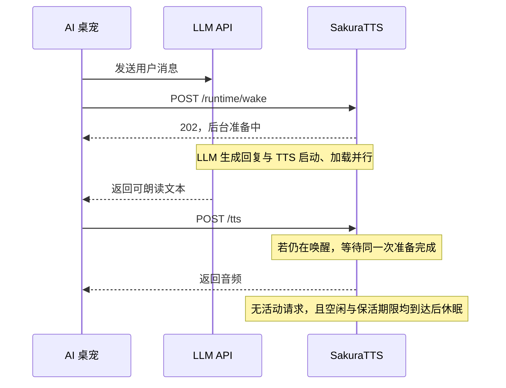

# SakuraTTS

**为 AI 桌宠优化的 GPT-SoVITS 推理引擎。**

桌宠大部分时间在等待交互，开口时又需要尽快发声。SakuraTTS 围绕这种使用方式，降低语音合成的显存占用，并提供空闲休眠和提前唤醒：桌宠向 LLM API 发出请求时，同时启动 TTS，让模型加载与等待回复的时间重叠。

SakuraTTS 使用 GPT-SoVITS 模型，提供兼容原版 API V2 的 HTTP 服务，以及 Python 和命令行入口。日常推理由原生 CUDA GPT 与 ONNX Runtime 声学后端完成，模型转换、参考音频编码放在独立准备进程中，主推理进程不导入 PyTorch。

## 适合什么场景

- **AI 桌宠与语音助手**：发起 LLM 请求时提前唤醒，取得可朗读文本后合成；对话结束后自动休眠。
- **与游戏、渲染软件共用显卡**：按需要选择显存档位，空闲时退出推理进程，归还进程持有的 GPU 资源。
- **接入已有 GPT-SoVITS 客户端**：沿用 API V2 的文本、参考音频等字段，支持完整音频和按句流式返回。具体兼容范围见 [API V2 使用说明](docs/api-v2-guide.md)。

当前为开发者预览版，公共入口面向 **Windows / NVIDIA、V2ProPlus**，支持日文；配置[英文资源](docs/english-frontend.md)后支持英文与日英混合。当前一次处理一条活动请求，中文及 CPU / AMD / Apple 公共后端尚未接入。设备、模型和音质的验证范围见[兼容矩阵](docs/specs/compatibility-matrix.md)。

## 优化效果

### 同精度下的显存对比

以下来自 2026-09-21 的同机测试：RTX 5060 8 GB、Windows 11 WDDM、Sakura V2ProPlus 日文。每组执行两轮共 12 次请求，覆盖短句、长句及多句文本，使用相同权重、参考音频、输入和采样参数。显存降幅由未舍入的原始读数计算。各档均与同精度原版比较；低显存档和极限档来自后续声学错峰测试，原版未在该轮重跑，标有 † 的降幅为跨轮次参考。

#### 峰值显存

| 精度与配置 | 原版观测峰值 | SakuraTTS 观测峰值 | 峰值降低 |
| --- | ---: | ---: | ---: |
| FP32 默认档 | 3931.7 MB | 2148.6 MB | **45.4%** |
| FP16 标准档 | 2323.2 MB | 758.2 MB | **67.4%** |
| FP16 低显存档 † | 2323.2 MB | 584.1 MB | **74.9%** † |
| FP16 极限档 † | 2323.2 MB | 465.1 MB | **80.0%** † |

#### 请求后空闲显存

这里的空闲指最后一次请求后约 1 秒，**尚未进入休眠**。

| 精度与配置 | 原版空闲显存 | SakuraTTS 空闲显存 | 空闲降低 |
| --- | ---: | ---: | ---: |
| FP32 默认档 | 3076.0 MB | 1253.1 MB | **59.3%** |
| FP16 标准档 | 1677.2 MB | 569.4 MB | **66.0%** |
| FP16 低显存档 † | 1677.2 MB | 387.0 MB | **76.9%** † |
| FP16 极限档 † | 1677.2 MB | 106.5 MB | **93.7%** † |

显存使用 WDDM 进程 Dedicated Usage，SakuraTTS 汇总主进程与声学 worker 的同一时刻计数；MB 为十进制单位。测量使用已准备的参考条件，不含首次转换和陌生参考准备；采样可能漏过短暂尖峰。两套引擎的随机数实现与输出长度不同，因此这些数据用于比较同一应用请求的资源开销，不用于推导统一加速倍数。FP32 与 FP16 标准档见[同精度实测报告](https://github.com/Rvosy/SakuraTTS/blob/main/research/notes/low-vram-20260921.md)，低显存档与极限档及其跨轮次对照见[声学错峰报告](https://github.com/Rvosy/SakuraTTS/blob/main/research/notes/acoustic-session-staging-20260921.md)。

#### 合成耗时

下表为热请求的**完整音频生成耗时中位数**，不是流式首包延迟，也不包含从休眠唤醒的时间。短句取 3 次、长句取 2 次，测量期间持续采集显存。

| 引擎与配置 | 热短句耗时 | 热长句耗时 | 输出音频时长（短句 / 长句） |
| --- | ---: | ---: | ---: |
| 原版 FP32 | 0.615 s | 5.548 s | 2.02 / 27.30 s |
| SakuraTTS FP32 默认档 | **0.289 s** | **3.290 s** | 3.46 / 25.90 s |
| 原版 FP16 | 0.508 s | 4.407 s | 2.02 / 27.30 s |
| SakuraTTS FP16 标准档 | **0.234 s** | **2.677 s** | 3.46 / 25.46 s |
| SakuraTTS FP16 低显存档 | 1.009 s | 3.560 s | 3.46 / 25.46 s |
| SakuraTTS FP16 极限档 | 3.055 s | 5.481 s | 3.46 / 25.46 s |

原版两档与 SakuraTTS FP32 取自[首轮汇总数据](https://github.com/Rvosy/SakuraTTS/blob/main/research/experiments/data/2026-09-21-low-vram.json)，SakuraTTS 三个 FP16 档取自[声学错峰轮次](https://github.com/Rvosy/SakuraTTS/blob/main/research/experiments/data/2026-09-21-acoustic-session-staging.json)。输入相同，但原版与 SakuraTTS 的生成长度不同，且部分数据跨轮次，因此不把这些耗时换算成固定工作量的加速倍数。

标准档适合连续短句；低显存档与极限档通过片段重载进一步节省显存，也增加等待。四档配置和使用条件见[推理档位](docs/inference-profiles.md)。默认仍为 FP32，FP16 需匹配的转换模型包，人工听感验收尚未完成。

### 休眠后的资源占用

`managed` 模式在空闲时退出整棵自有推理进程树，保留轻量 HTTP 控制服务。Windows 标准档实测中，休眠后推理进程的 GPU 计数实例消失，控制服务及启动器的系统内存 RSS 中位数约 **68 MB**、私有提交约 **45.5 MB**；这两个主存指标不能相加，也不是显存。

同机已完成 **100 轮真实模型唤醒与休眠**，每轮确认推理子进程退出，期间 11 次合成的 PCM 与固定样本一致。该结果不等于数小时挂机或所有设备验证，完整条件见[后台运行实测](https://github.com/Rvosy/SakuraTTS/blob/main/research/notes/managed-refinement-20260922.md)。

## 在等待 LLM 回复时准备语音

桌宠收到用户消息后，可以同时请求 LLM API 和 SakuraTTS 的唤醒接口。这样，进程启动和模型加载可以在 LLM 生成回复时完成。



启用后台控制模式：

```powershell
.\start-server.bat -c configs/tts_infer.yaml --runtime-mode managed --idle-sleep-seconds 60
```

在发出 LLM 请求的同时调用：

```http
POST /runtime/wake
Content-Type: application/json

{"keep_alive_seconds":60}
```

收到文本后照常调用 `/tts`，无需轮询等待唤醒完成。流式 LLM 可在第一句可朗读文本形成后开始合成，后续句子由桌宠串行提交并管理播放队列。未提前唤醒时，`/tts` 也会自动唤醒，只是启动耗时落在文本到达之后。

**提前加载与执行预热是两步。** 当前 `/runtime/wake` 不会自动试合成：标准档可提前加载模型，首次执行、CUDA Graph 捕获和新参考准备仍可能发生在第一条 `/tts` 中。若宿主需要执行预热，可在 LLM 等待期间另发一条短句合成并丢弃音频，完成后再提交正式文本；这会占用推理槽位和算力，实际收益需要在目标设备上测量。极限档按片段重载模型，提前唤醒只准备运行环境，不能消除每片段加载成本。

在已有编译与参考缓存的 RTX 5060 单机记录中，FP16 标准档唤醒准备耗时 4.172 s，准备后的第一句首 PCM 为 1.078 s，随后两句为 0.239 / 0.234 s。它说明提前加载能转移一部分首句等待，但不是端到端桌宠延迟保证。集成步骤、预热取舍与测量来源见[后台驻留与提前唤醒](docs/background-runtime.md)。

## 快速开始

[Windows / NVIDIA 整合包](docs/portable-bundle.md)自带 Python 与运行依赖，完整包还带有模型转换和参考准备组件。模型与参考音频由使用者提供。解压后：

1. 复制 `configs/tts_infer.example.yaml` 为 `configs/tts_infer.yaml`，填写自己的 GPT / SoVITS 权重路径。
2. 运行 `check-runtime.bat` 检查 GPU，再运行 `start-server.bat`。桌宠接入可使用上面的 `managed` 启动命令。
3. 向默认地址 `http://127.0.0.1:9880/tts` 提交合成请求，或打开 `/docs` 查看接口。

将参考音频路径和转写替换为自己的内容：

```powershell
curl.exe -X POST http://127.0.0.1:9880/tts -H "Content-Type: application/json" --data-raw '{"text":"こんにちは。","text_lang":"ja","ref_audio_path":"D:/Voices/reference.wav","prompt_text":"参考音声です。","prompt_lang":"ja","parallel_infer":false}' --output hello.wav
```

请求须显式传 `parallel_infer=false`。首次模型转换和参考准备可能比后续请求耗时更长，建议在正式对话前完成一次首次合成。源码安装、Python 示例和资源准备见[快速开始](docs/quickstart.md)。

## 文档

| 需求 | 入口 |
| --- | --- |
| 安装、模型准备与首次生成 | [快速开始](docs/quickstart.md)、[Windows 整合包](docs/portable-bundle.md) |
| 桌宠接入、休眠、唤醒与预热 | [后台运行](docs/background-runtime.md) |
| HTTP 请求与服务配置 | [API V2 使用说明](docs/api-v2-guide.md)、[HTTP API](docs/http-api.md) |
| 精度、显存与延迟取舍 | [推理档位](docs/inference-profiles.md) |
| 嵌入 Python 或准备模型包 | [Python API](docs/python-api.md)、[模型目录](docs/model-format.md) |
| 参与开发 | [开发指南](docs/development.md)、[架构](docs/architecture.md) |
| 其他指南与规范 | [文档索引](docs/README.md) |

## 许可与致谢

SakuraTTS 基于 [GPT-SoVITS](https://github.com/RVC-Boss/GPT-SoVITS) 的模型与推理研究构建独立运行引擎。项目代码采用 [MIT](LICENSE)，第三方代码和字典声明见 [docs/third-party](docs/third-party)。角色模型、参考音频和 NVIDIA 运行库适用各自的许可。
