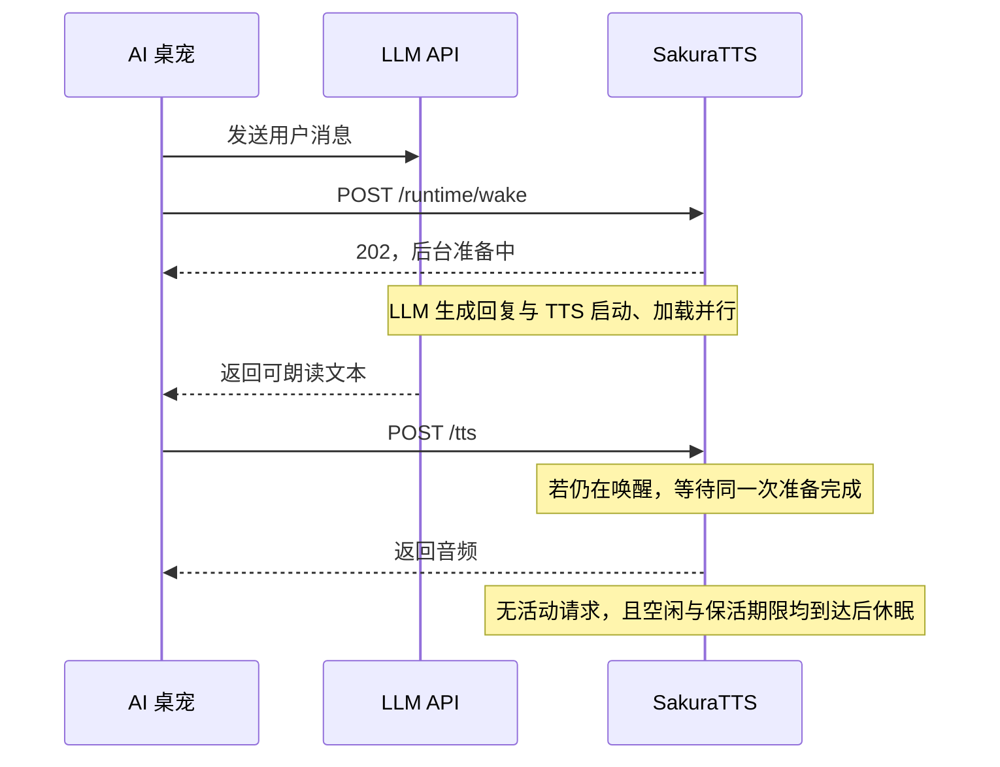

<h1 align="center">SakuraTTS</h1>

<p align="center">
  <strong>为 AI 桌宠优化的 GPT-SoVITS 推理引擎</strong>
</p>

<p align="center">
  
  
  
  <a href="LICENSE"></a>
</p>

<p align="center">
  <a href="#快速开始">快速开始</a> ·
  <a href="#性能对比">性能对比</a> ·
  <a href="docs/api-v2-guide.md">API 文档</a> ·
  <a href="#休眠与唤醒">休眠与唤醒</a> ·
  <a href="docs/README.md">文档索引</a>
</p>

---

SakuraTTS 是面向 AI 桌宠的 GPT-SoVITS 推理引擎，沿用原版角色模型和 API V2 调用方式，专注于降低合成耗时、显存占用和长期待机成本。

桌宠需要长时间挂机，却只在交互时说话。原版推理服务在合成结束后仍会保留模型和缓存，这部分常驻显存会与游戏及其他应用争用资源。SakuraTTS 为此提供四档推理配置，并支持空闲休眠：无交互时释放推理进程持有的 GPU 资源，桌宠发起 LLM 请求时提前唤醒，利用等待回复的时间启动和加载模型。

已有的 GPT `.ckpt`、SoVITS `.pth` 和参考音频可以继续使用，无需重新训练。完整整合包会在首次使用时自动转换并缓存支持的模型；客户端继续通过 `/tts` 请求语音，也可以使用 Python 或命令行接口。

> 当前为开发者预览版，支持 Windows / NVIDIA、V2ProPlus、日文，以及配置[英文资源](docs/english-frontend.md)后的英文与日英混合。HTTP 兼容范围见 [API V2 文档](docs/api-v2-guide.md)，模型与设备验证情况见[兼容矩阵](docs/specs/compatibility-matrix.md)。

## 快速开始

[Windows / NVIDIA 整合包](docs/portable-bundle.md)自带 Python 与运行依赖，完整包还带有模型转换和参考准备组件。模型与参考音频由使用者提供。解压后：

1. 复制 `configs/tts_infer.example.yaml` 为 `configs/tts_infer.yaml`，填写自己的 GPT / SoVITS 权重路径。
2. 运行 `check-runtime.bat` 检查 GPU，再运行 `start-server.bat`。需要空闲自动释放资源时，按下文启用[休眠与唤醒](#休眠与唤醒)。
3. 向默认地址 `http://127.0.0.1:9880/tts` 提交合成请求，或打开 `/docs` 查看接口。

将参考音频路径和转写替换为自己的内容：

```powershell
curl.exe -X POST http://127.0.0.1:9880/tts -H "Content-Type: application/json" --data-raw '{"text":"こんにちは。","text_lang":"ja","ref_audio_path":"D:/Voices/reference.wav","prompt_text":"参考音声です。","prompt_lang":"ja","parallel_infer":false}' --output hello.wav
```

请求须显式传 `parallel_infer=false`。首次模型转换和参考准备可能比后续请求耗时更长，建议在正式对话前完成一次首次合成。源码安装、Python 示例和资源准备见[快速开始](docs/quickstart.md)。

## 性能对比

测试环境：RTX 5060 8 GB、Windows 11 WDDM、Sakura V2ProPlus 日文。每组使用相同权重、参考音频、输入和采样参数，执行两轮共 12 次请求，覆盖短句、长句与多句文本。

显存与同精度原版比较，单位为十进制 MB。† 表示沿用上一轮原版数据的跨轮次参考，低显存档和极限档所在轮次没有重跑原版。

### 峰值显存

| 精度与配置 | 原版观测峰值 | SakuraTTS 观测峰值 | 峰值降低 |
| --- | ---: | ---: | ---: |
| FP32 默认档 | 3931.7 MB | 2148.6 MB | **45.4%** |
| FP16 标准档 | 2323.2 MB | 758.2 MB | **67.4%** |
| FP16 低显存档 † | 2323.2 MB | 584.1 MB | **74.9%** † |
| FP16 极限档 † | 2323.2 MB | 465.1 MB | **80.0%** † |

### 请求后空闲显存

这里的空闲指最后一次请求后约 1 秒，**尚未进入休眠**。

| 精度与配置 | 原版空闲显存 | SakuraTTS 空闲显存 | 空闲降低 |
| --- | ---: | ---: | ---: |
| FP32 默认档 | 3076.0 MB | 1253.1 MB | **59.3%** |
| FP16 标准档 | 1677.2 MB | 569.4 MB | **66.0%** |
| FP16 低显存档 † | 1677.2 MB | 387.0 MB | **76.9%** † |
| FP16 极限档 † | 1677.2 MB | 106.5 MB | **93.7%** † |

### 合成耗时

下表为热请求的**完整音频生成耗时中位数**，不是流式首包延迟，也不包含从休眠唤醒的时间。短句取 3 次、长句取 2 次，测量期间持续采集显存。

| 引擎与配置 | 热短句耗时 | 热长句耗时 | 输出音频时长（短句 / 长句） |
| --- | ---: | ---: | ---: |
| 原版 FP32 | 0.615 s | 5.548 s | 2.02 / 27.30 s |
| SakuraTTS FP32 默认档 | **0.289 s** | **3.290 s** | 3.46 / 25.90 s |
| 原版 FP16 | 0.508 s | 4.407 s | 2.02 / 27.30 s |
| SakuraTTS FP16 标准档 | **0.234 s** | **2.677 s** | 3.46 / 25.46 s |
| SakuraTTS FP16 低显存档 | 1.009 s | 3.560 s | 3.46 / 25.46 s |
| SakuraTTS FP16 极限档 | 3.055 s | 5.481 s | 3.46 / 25.46 s |

标准档适合连续短句；低显存档与极限档通过片段重载进一步节省显存，也增加等待。四档配置和使用条件见[推理档位](docs/inference-profiles.md)。默认仍为 FP32，FP16 需匹配的转换模型包，人工听感验收尚未完成。

<details>
<summary>测量口径与数据来源</summary>

显存使用 WDDM 进程 Dedicated Usage，SakuraTTS 汇总主进程与声学 worker 的同一时刻计数；MB 为十进制单位。测量使用已准备的参考条件，不含首次转换和陌生参考准备；采样可能漏过短暂尖峰。两套引擎的随机数实现与输出长度不同，因此这些数据用于比较同一应用请求的资源开销，不用于推导统一加速倍数。FP32 与 FP16 标准档见[同精度实测报告](https://github.com/Rvosy/SakuraTTS/blob/main/research/notes/low-vram-20260921.md)，低显存档与极限档及其跨轮次对照见[声学错峰报告](https://github.com/Rvosy/SakuraTTS/blob/main/research/notes/acoustic-session-staging-20260921.md)。

原版两档与 SakuraTTS FP32 取自[首轮汇总数据](https://github.com/Rvosy/SakuraTTS/blob/main/research/experiments/data/2026-09-21-low-vram.json)，SakuraTTS 三个 FP16 档取自[声学错峰轮次](https://github.com/Rvosy/SakuraTTS/blob/main/research/experiments/data/2026-09-21-acoustic-session-staging.json)。输入相同，但原版与 SakuraTTS 的生成长度不同，且部分数据跨轮次，因此不把这些耗时换算成固定工作量的加速倍数。

显存降幅由未舍入的读数计算。硬件实测集中于 RTX 5060，尚未单独测量对游戏帧率的影响。

</details>

## 休眠与唤醒

启用 `managed` 模式后，HTTP 服务保持运行，推理进程按需启动。没有活动请求且空闲与保活期限均到达时，推理进程及其子进程退出，释放它们持有的 GPU 资源。

```powershell
.\start-server.bat -c configs/tts_infer.yaml --runtime-mode managed --idle-sleep-seconds 60
```

桌宠可以在向 LLM API 发送消息的同时调用 `/runtime/wake`，让模型加载与回复生成并行。取得可朗读文本后照常提交 `/tts`；如果加载尚未结束，请求会等待同一次准备完成。



在发出 LLM 请求的同时调用：

```http
POST /runtime/wake
Content-Type: application/json

{"keep_alive_seconds":60}
```

流式 LLM 可以在第一句形成后开始合成，由桌宠串行提交后续句子并管理播放队列。未提前唤醒时，`/tts` 也会自动启动推理进程。LLM 请求失败或最终不需要语音时，让保活自然过期即可。

`wake` 提前完成启动与加载，不会自动试合成。需要执行预热时，宿主可在等待 LLM 期间提交一条短句、完整接收并丢弃音频，再提交正式文本。极限档按片段重载模型，提前唤醒只准备运行环境。具体流程和取舍见[后台运行指南](docs/background-runtime.md)。

Windows 标准档的既有测量中，休眠后推理进程的 GPU 计数实例消失，控制服务及启动器的系统内存 RSS 中位数约 68 MB、私有提交约 45.5 MB；两者是不同的主存指标，不能相加。同机完成了 100 轮真实模型睡醒，每轮确认推理子进程退出。测量条件、首句耗时及尚未覆盖的长期测试见[睡醒实测报告](https://github.com/Rvosy/SakuraTTS/blob/main/research/notes/managed-refinement-20260922.md)。

## 文档

| 需求 | 入口 |
| --- | --- |
| 安装、模型准备与首次生成 | [快速开始](docs/quickstart.md)、[Windows 整合包](docs/portable-bundle.md) |
| 桌宠接入、休眠、唤醒与预热 | [后台运行](docs/background-runtime.md) |
| HTTP 请求与服务配置 | [API V2 使用说明](docs/api-v2-guide.md)、[HTTP API](docs/http-api.md) |
| 精度、显存与延迟取舍 | [推理档位](docs/inference-profiles.md) |
| 嵌入 Python 或准备模型包 | [Python API](docs/python-api.md)、[模型目录](docs/model-format.md) |
| 参与开发 | [开发指南](docs/development.md)、[架构](docs/architecture.md) |
| 其他指南与规范 | [文档索引](docs/README.md) |

## 许可与致谢

SakuraTTS 基于 [GPT-SoVITS](https://github.com/RVC-Boss/GPT-SoVITS) 的模型与推理研究构建独立运行引擎。项目早期参考了 [GSV-TTS-Lite](https://github.com/chinokikiss/GSV-TTS-Lite) 和 [Genie-TTS](https://github.com/High-Logic/Genie-TTS) 的推理实现与工程组织，感谢这些项目的作者和贡献者。

项目代码采用 [MIT](LICENSE)，第三方代码和字典声明见 [docs/third-party](docs/third-party)。角色模型、参考音频和 NVIDIA 运行库适用各自的许可。
