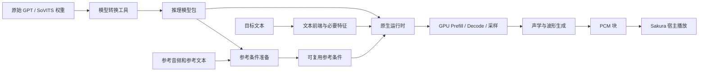

# 原生 GPU 运行时初始方案

方案形成于 2026-09-19，并记录了 2026-09-20 Windows 路径的补充。以下保留当时的候选、里程碑与未验收项；采用的架构决定见 [ADR 0001](../../docs/adr/0001-native-gpu-runtime.md)。

状态：转换与运行时分离方向已确认；2026-09-20 接通一条 Windows / NVIDIA 路径，整体产品验收仍未完成。初始日期：2026-09-19。

## 背景

项目需要保留 GPT-SoVITS 模型生态，同时降低桌宠 TTS 的安装体积、显存和延迟。用户报告现有整合包超过 8 GB，当前尚未取得可复现的文件清单，不能把这个数字当作已测量的项目基线。

讨论前半段建议先用精简 PyTorch 建立 GPU 基线，后半段进一步提出独立原生运行时，并将 PyTorch 留给开发、转换和验证。本文采用后者作为交付方向；精简 PyTorch 仍可作为实验工具。

KV 优化能减少解码复制与调度开销，但安装体积还受运行库、辅助模型、语言资源及重复产物影响。模型文件共享也不等于多个执行实例在 GPU 上共享权重。需要同时设计计算与资源生命周期。

来源及核对范围见 [研究与证据](https://github.com/Rvosy/SakuraTTS/blob/main/research/notes/gpu-inference.md)。

2026-09-19 先完成 Mac 上游 MPS / FP32 功能验证，首个样本为“朱雀院红叶”V2Pro。2026-09-20 转入 Windows / RTX 5060 8 GB，以另一组 Sakura V2ProPlus 建立独立对照；Mac 结果不作为该设备的性能结论。

## 当前 Windows 路径

Windows 采用自有 CuPy CUDA GPT 执行器与 ORT CUDA SoVITS 子图。GPT 复用一份权重、预分配 KV 并原地追加，通过 CUDA Graph 减少稳定形状下的提交开销；采样与停止沿用已有控制代码。声学图使用真实 V2ProPlus 的条件维度与声码器结构，参考语义和说话人条件在准备阶段保存。日常运行不导入 PyTorch，不常驻参考编码辅助模型。

本机离线可用的 ORT CUDA 1.19.2 属于 CPython 3.9 ABI，主环境为 Python 3.11，因此暂用独立、持久的声学工作进程承载该运行库。经典日文前端也使用包内 `pyopenjtalk 0.3.4` 与原主字典，通过单独 CPU 工作进程执行；开发环境的 plus 版本在部分文本上输出不同，不能静默替换。两个组件均复制为项目自己的资源，普通运行不读取原 g50。不同 Python ABI 的进程安排是本轮离线部署取舍，后续可在同一计算路径下整合运行环境，无需建立多后端框架。

代价包括工作进程的 CPU 内存、数组传输和较大的运行库体积。这些成本必须计入完整请求、冷启动与卸载测量。当前组件由本机文件离线组装，其他干净机器安装和完整再分发材料尚待验收。具体版本、来源和结果见 [Windows 指南](../../docs/setup-windows-nvidia.md) 与 [实测记录](https://github.com/Rvosy/SakuraTTS/blob/main/research/experiments/2026-09-20-windows-nvidia-backend.md)。后文的 C++、TensorRT 和量化内容仍是候选方向。

## Mac 研发与 Windows 交付边界

生产以 Windows / NVIDIA CUDA 为重点。Mac 先完成可以继承的模型转换、文本语义、参考条件包、共享加载、静态权重计算、KV 所有权与资源生命周期；MLX 是当前验证实现，不预先成为生产后端或抽象接口标准。

Metal 专用融合和深层算子调优暂缓。已有严格数值失败继续保留，高精度对照继续可用；下一阶段优先补齐原始文本请求链。CUDA Graph、TensorRT 编译与工作区、Tensor Core 排布、设备分配和真实独显指标，必须在目标机器复验。Mac 的 RSS / MPS / MLX 指标不能换名写成 NVIDIA 显存。

静态 WeightNorm、布局和不变参考投影优先移到转换或加载阶段，每项分别验证输出和加载、常驻、请求成本。硬件优化归档必须绑定对应运行库和架构，不能把通用策略等同于跨硬件二进制兼容。

## 拟议方案

使用独立转换工具生成推理模型包，由自有运行时管理模型、请求、缓存和音频输出；C++ 部署实现留待 Windows 后端定案。矩阵乘法、卷积和可复用的注意力算子优先交给成熟计算库；仅在性能分析证明必要时实现专用 CUDA 算子。

最终运行包选择一条生产主路径。可以在研发阶段比较多种后端，不同时维护、分发完整 PyTorch、ONNX Runtime、TensorRT 和 TensorRT-RTX 四套产品路径。

这是一组职责边界，不要求各自成为服务、进程或插件。先完成本地单请求链路，避免引入不必要的框架。

## 模块安排

| 模块 | 自己需要掌握的内容 | 借用现有能力的范围 |
|---|---|---|
| 转换器 | 版本识别、权重映射、推理图、包描述与校验 | PyTorch 加载及导出工具 |
| 文本前端 | 规范化、分句、音素和特征对齐的行为 | 已验证的词典、G2P 与特征模型实现，另行核对依赖和许可 |
| 参考准备 | 参考语义、音色条件、缓存身份与持久化 | 对应模型的编码计算 |
| 语义执行器 | Prefill、Decode、缓存、采样和停止状态 | 线性层、注意力、归一化等算子 |
| 音频生成器 | 阶段拆分、块边界、噪声管理和工作区 | 卷积、flow、波形生成子图 |
| 运行控制 | 加载、取消、卸载、背压和错误传播 | 宿主负责播放及产品交互 |

原生化不仅涉及神经网络。文本前端若依赖大型 Python 包或语言模型，也会影响最终体积，需要在 M0 / M1 清点并确定实现方式，不能留到打包时才处理。

与 Sakura 的 Provider / Runtime Pack 对接是集成方向，尚未核对宿主当前接口。首版通过独立 Harness 验证，集成时再确认传输、PCM 格式和取消协议，不在这里提前固定 HTTP 或 IPC。

## GPU 执行安排

Prefill 处理完整前缀及其混合注意力掩码；Decode 使用单 token 路径。KV、历史 token、长度和停止状态尽量留在 GPU，避免逐步经由主机传递大张量。

先使用单请求连续 KV 和少量按需容量档位。图捕获的目标范围包括 Embedding、Transformer、输出投影、采样及状态更新，但是否能全部捕获由实际后端决定。地址、shape 或模型变化后重建相关状态。

主机可在有限步数或音频块边界读取停止状态，GPU 仍负责正确标记 EOS。检查间隔同时影响提交开销、取消延迟和结束后多余计算，必须一起测量。

GPU 常驻不等于安全原地更新。I/O Binding 只能解决输入输出放置的一部分问题；是否复制整段 KV、是否允许输入输出别名、是否出现 CPU 节点，需要核对运行库约定和执行轨迹。

SoVITS 单独安排工作区和阶段复用。文本编码与参考投影仅在依赖不变时缓存；非因果或全局依赖不能通过任意裁剪历史来删除。首个正确版本允许先完整生成波形，随后实现满足契约的流式路径。

## 后端选择实验

Mac 研发阶段已有 [MLX / Metal GPT 实验](https://github.com/Rvosy/SakuraTTS/blob/main/research/experiments/2026-09-19-mlx-gpt.md)、[自有历史采样](https://github.com/Rvosy/SakuraTTS/blob/main/research/experiments/2026-09-19-native-gpt-generation.md)和[完整声学计算](https://github.com/Rvosy/SakuraTTS/blob/main/research/experiments/2026-09-19-mlx-sovits-complete.md)，用于验证独立模型包、非 PyTorch 运行依赖和算子语义。随后已接通[原始日文到 PCM](https://github.com/Rvosy/SakuraTTS/blob/main/research/experiments/2026-09-19-native-japanese-text-speech.md)，并将原始参考准备放入独立开发工具；扩展中间结果仍有数值失败。生产后端继续依据 Windows 实测选择。

| 候选 | 选择理由 | 首轮必须回答的问题 |
|---|---|---|
| TensorRT-RTX + 必要 CUDA 算子 | 面向桌面 RTX，适合提前评估运行库体积与子图编译 | 目标 GPU / 系统是否支持；动态长度、声学图和精度是否可用；JIT 冷启动、缓存、工作区和分发依赖有多大 |
| ONNX Runtime CUDA + 必要 CUDA 算子 | 图导出和 C++ 接口可作为对照 | 是否存在 CPU 节点或隐式复制；KV 更新是否复制整段；多 Session 是否重复存权重；最小运行依赖有多大 |
| 原生语义执行器 + 图运行库执行声学部分 | 对有状态解码和缓存所有权更直接 | 专用代码的维护成本能否换来实际收益；小矩阵、注意力、采样和同步是否优于图路径 |

TensorRT-RTX 与传统 TensorRT、TensorRT-LLM 分别评估，不用某一产品的说明推断另一产品的能力。当前先做小规模子图与端到端实验，再决定生产依赖，不把候选都抽象成正式插件接口。

选择条件是：通过正确性与部署检查，能在目标硬件上满足同一套体积、显存和延迟预算。若存在速度与显存取舍，保存原始结果，说明适用配置；不能仅凭 token/s 最高就定案。

## 体积与显存安排

分发内容按用途拆开，以下是逻辑边界，目录名尚未冻结：

| 内容 | 日常运行是否需要 |
|---|---|
| 原生引擎与必要 GPU 运行库 | 需要 |
| 当前角色的 GPT / SoVITS 模型及参考条件 | 需要 |
| 当前语言的前端资源和必要特征模型 | 需要，可跨角色共享 |
| 参考音频编码模型 | 创建或修改参考资源时需要 |
| PyTorch、训练、导出和校准工具 | 日常运行不需要，单独提供 |
| 硬件编译缓存 | 可重建，有容量限制；计入首次运行后的体积 |

显存优化优先检查重复权重、常驻辅助模型、图捕获分配和声学工作区，再按占比决定是否压缩 KV。Prefill 与 Decode 的共享权重必须在设备内存中核实；复用临时空间时必须尊重实际异步依赖。

## 算子与量化优先级

首个版本保持模型结构和已验证的高精度路径。FP16 是待独立验证的候选，不能提前当作支持条件。性能分析后优先考察：

1. KV 原地写入与适合实际头维度、短历史的注意力。
2. 保持原模型顺序的偏置、残差和 LayerNorm 融合。
3. 采样、历史更新与 EOS 状态的 GPU 执行。
4. 不变特征复用及声学生成工作区限制。

权重量化在 FP16 基线通过后进行，先比较 GPT 线性层 W8 / W4A16，再分别评估中文特征和 SoVITS。MARLIN 类内核可作为实现参考，但需验证小矩阵形状、GPU 架构和权重布局。

KV INT8、INT4 等仅在缓存占比足够大时继续研究。量化收益必须包含尺度、临时空间和反量化成本；不能把压缩文件在加载时全部展开并同时常驻，再报告为低比特显存收益。

## 暂不采用的方案

| 方案 | 暂不采用的原因 | 重新评估的条件 |
|---|---|---|
| 仅修改 Genie 的 Execution Provider | 不会自动改变 NumPy 循环、复制与缓存所有权 | 完成设备数据流和缓存机制重写后，可作为子图对照 |
| 强制所有阶段导出为一张图 | 动态停止、状态更新和采样可能更适合原生控制 | 运行库明确支持且实测优于阶段拆分 |
| 分页 KV、多请求调度 | 首版只有一个活动请求，复杂度缺少收益依据 | 并发或长上下文成为实际需求 |
| 全链路 INT4、直接裁减网络层 | 数值与质量风险会混入兼容性重写 | 分模块量化证据充分，或另立需要训练的研究范围 |
| 投机解码、额外预测头 | 增加训练、兼容、分布验证和资源成本 | 基础引擎稳定，串行生成仍是主要瓶颈 |
| 从零实现全部 CUDA 数学算子 | 维护范围过大，缺少针对性 | 现有内核不能满足已定位的必要需求 |

## 代价与复审

该方案需要维护转换器、模型版本适配、原生文本处理与 GPU 二进制分发。显存释放和下一句热启动存在取舍；更小运行库也可能带来设备编译开销。

在 [实施路线](https://github.com/Rvosy/SakuraTTS/blob/main/research/notes/roadmap-20260920.md) M2 结束时复审本提案，填入实际后端、支持矩阵和测量依据，再将状态改为已接受或替换。C++、TensorRT-RTX 和性能目标目前都不能表述为已完成的产品能力。
